# SpotSync

A real-time collaborative map app for organizing shared places. Import directly from Google Maps, plan trips with friends, and stay in sync with instant updates and cross-platform push notifications. Built with React, Firebase, and Google Places API for a seamless mobile experience.

## Visual Overview

### Getting Started

|              Login              |               Register                |
| :-----------------------------: | :-----------------------------------: |
| 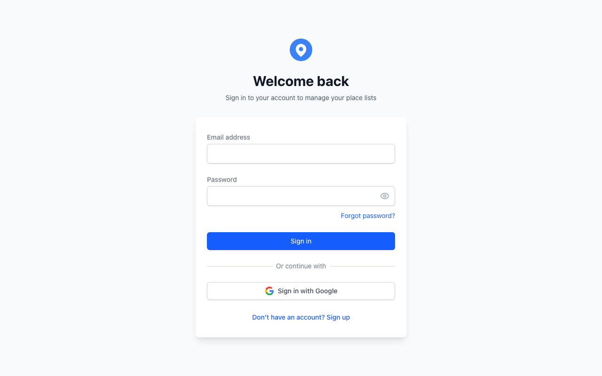 | 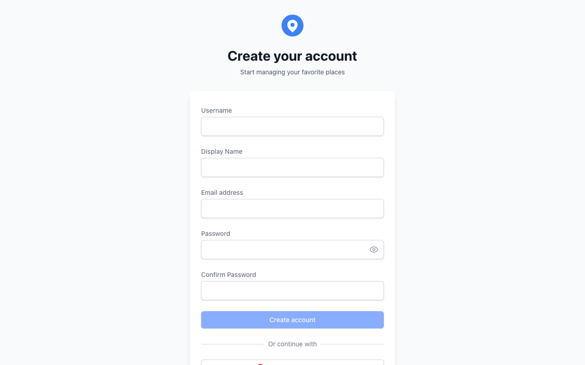 |

### Dashboard & Settings

|                Dashboard                |               Settings                |                       Account Linking                        |          Theme Options          |
| :-------------------------------------: | :-----------------------------------: | :----------------------------------------------------------: | :-----------------------------: |
| 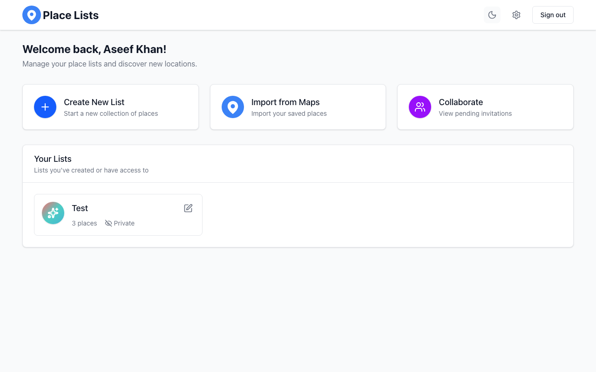 |  | 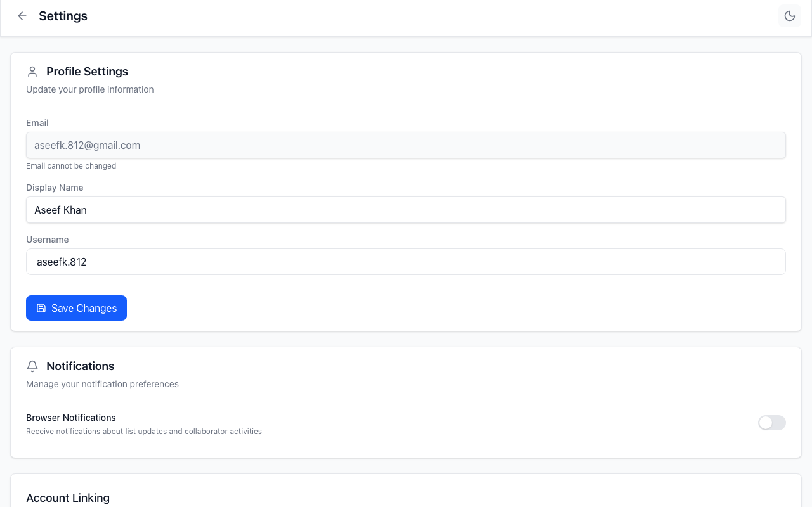 | 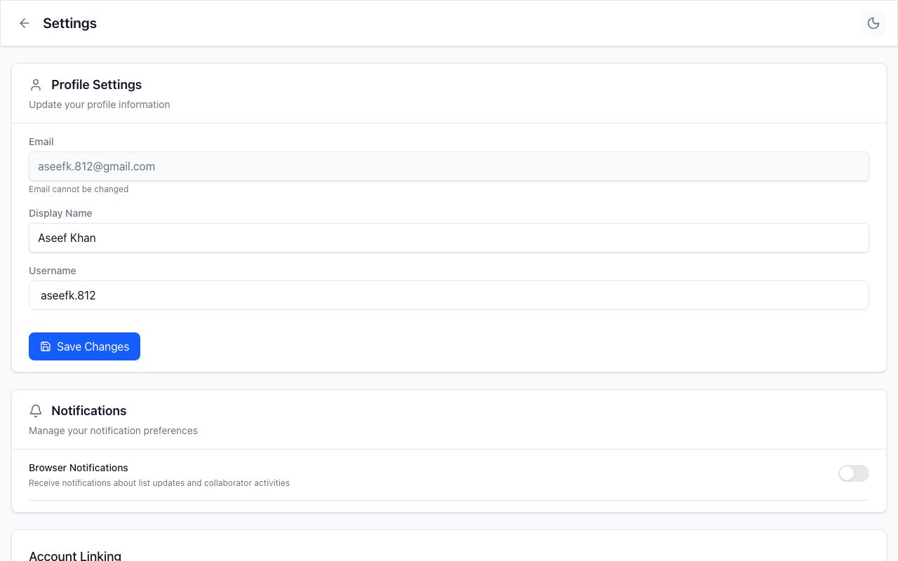 |

### List Management

Desktop list pages support **list** and **map** view modes. Map mode uses a `ResizableSplitPane` — drag the divider to resize the glassmorphic sidebar against the full-height map.

|                List View                |         Map View (Split Pane)         |                   Expanded Sidebar                   |                    Collaboration                    |
| :-------------------------------------: | :-----------------------------------: | :--------------------------------------------------: | :-------------------------------------------------: |
| 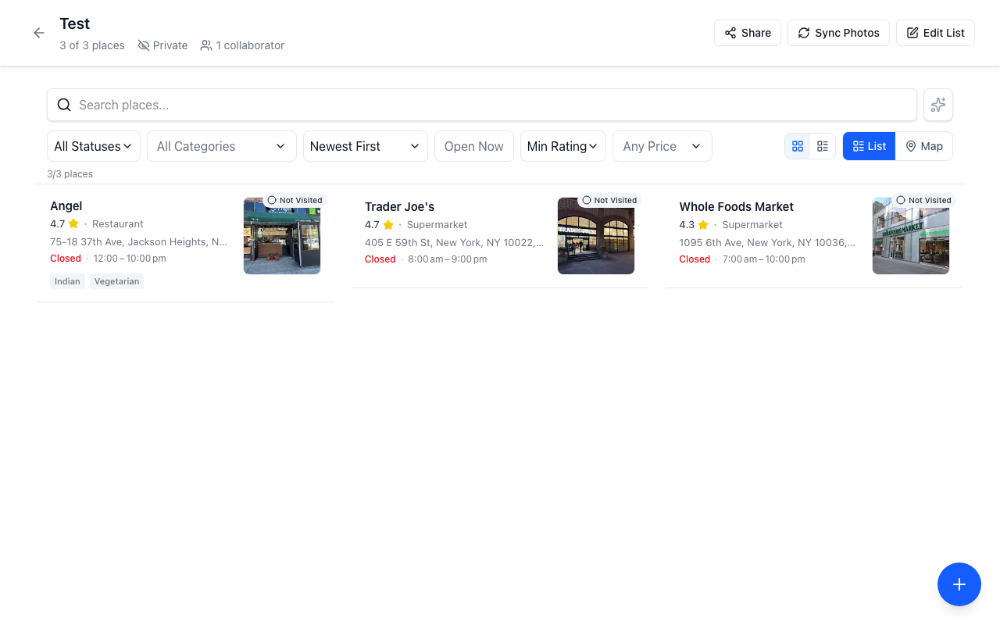 | 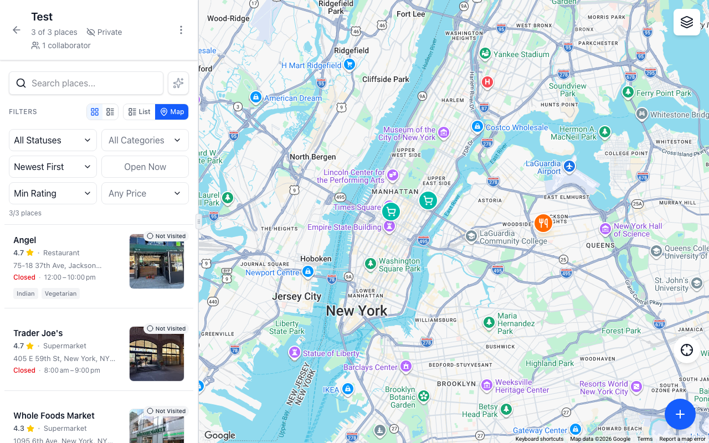 | 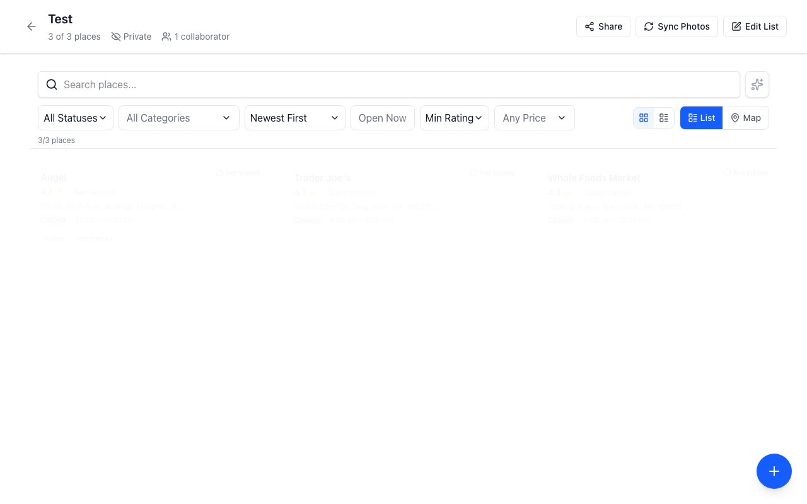 | 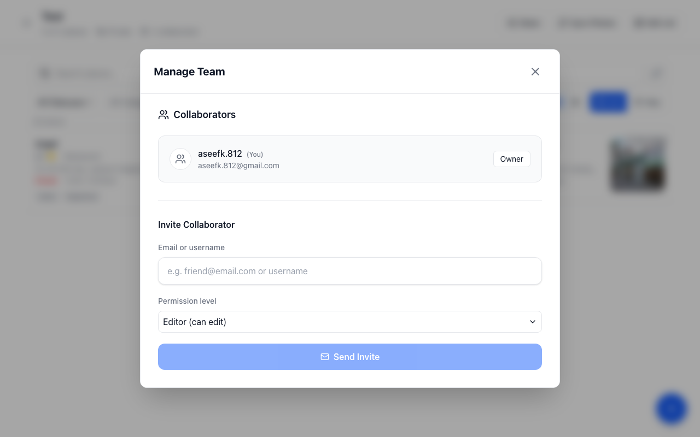 |

### Place Discovery & Details

Search and add flows use modals on the list layout; in map mode, search opens inline in the sidebar while markers stay visible on the map. Place details use `PlaceDetailsPane` with `PlacePhotoGallery` on desktop.

|              Search               |                     Map Selection                     |                       Selection Details                       |                  Place Details                  |
| :-------------------------------: | :---------------------------------------------------: | :-----------------------------------------------------------: | :---------------------------------------------: |
| 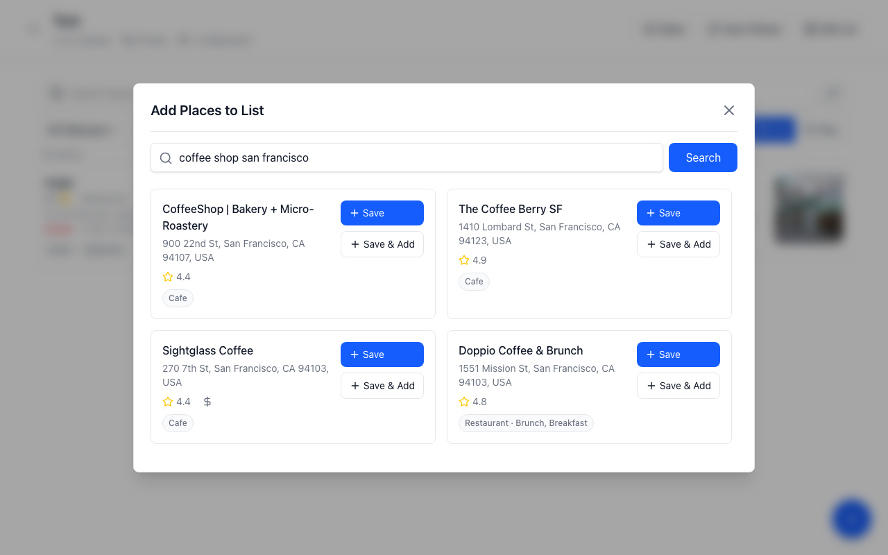 | 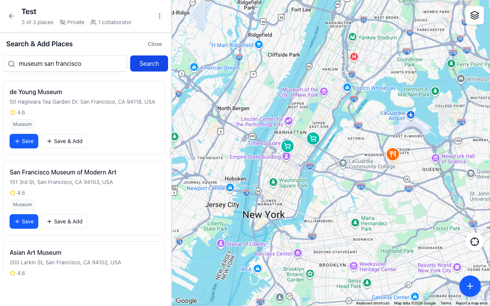 | 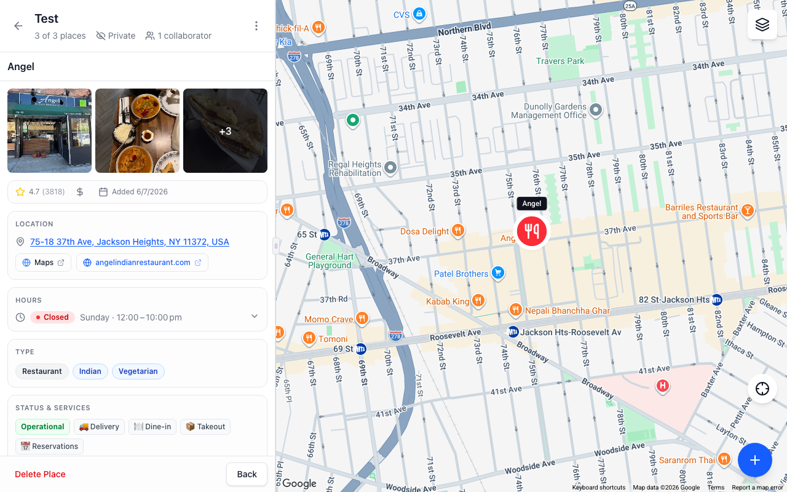 | 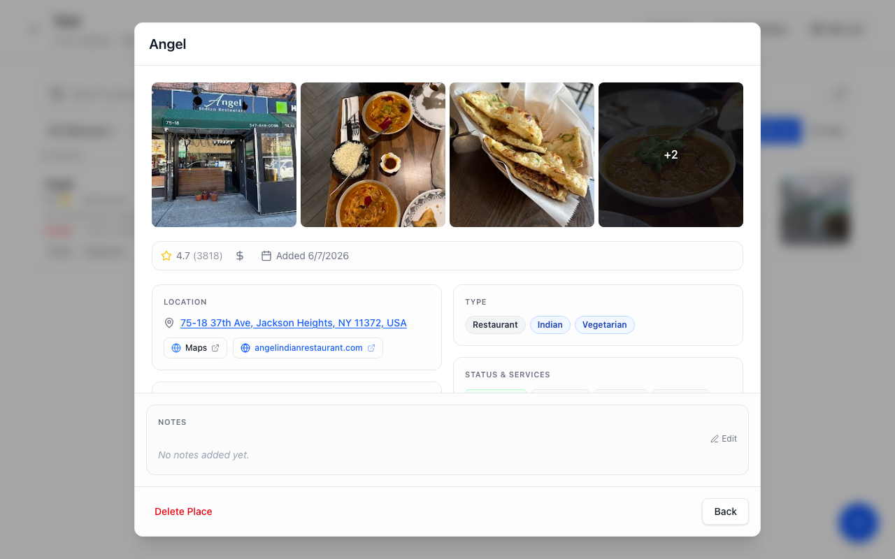 |

### Mobile Experience

On mobile, lists use a sticky map with a draggable bottom sheet for place cards and details (`MobileBottomSheet`).

|                          Dashboard                           |                       List + Map                        |                     Place Details (Bottom Sheet)                     |                     Map View                     |                         Search                         |
| :----------------------------------------------------------: | :-----------------------------------------------------: | :------------------------------------------------------------------: | :----------------------------------------------: | :----------------------------------------------------: |
| 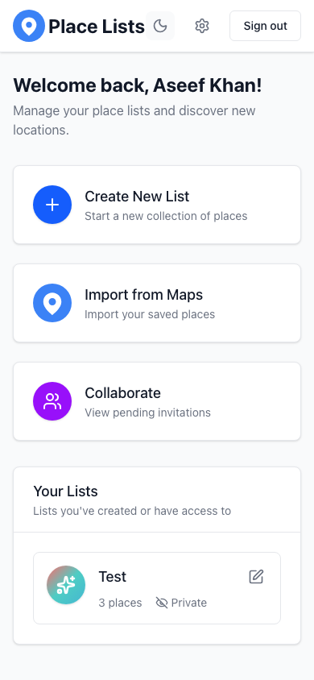 | 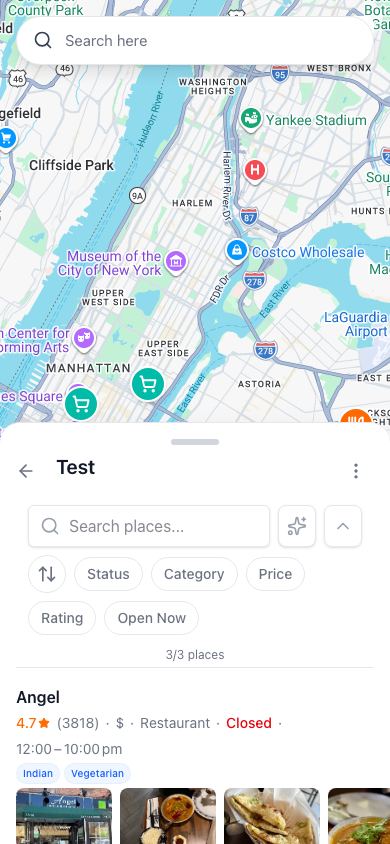 | 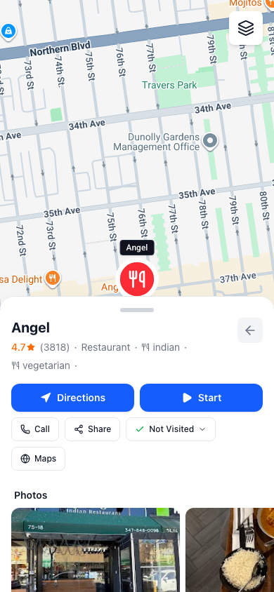 |  | 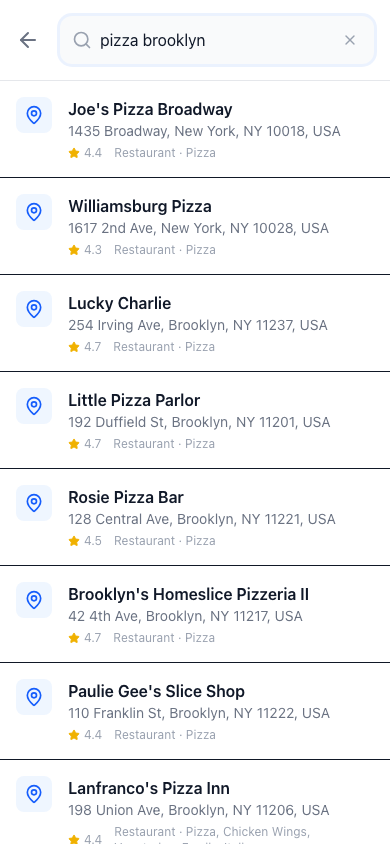 |

### Google Maps Import

|               Import Preview               |               Success State                |
| :----------------------------------------: | :----------------------------------------: |
| 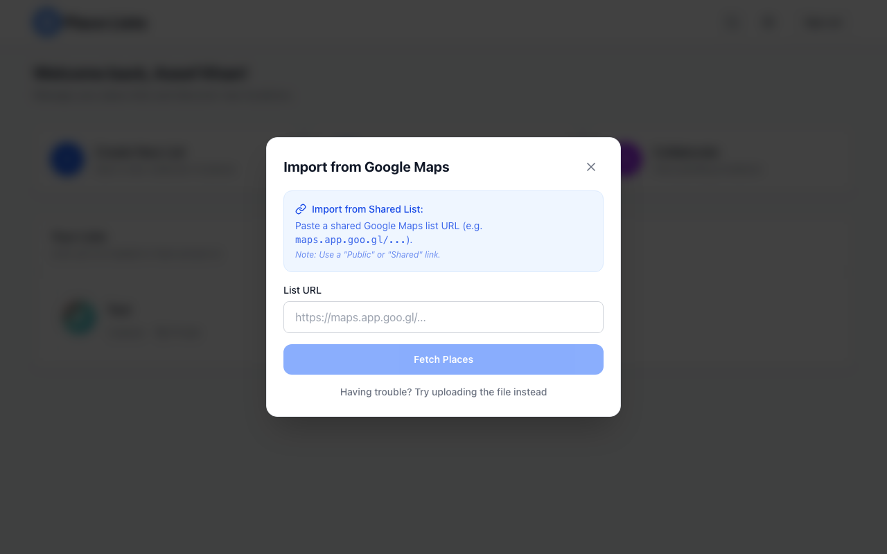 | 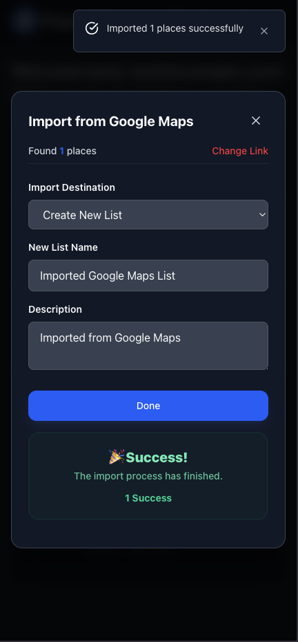 |

## Core Functionality

- **Secure Authentication**: Google OAuth and email/password sign-in. Email/password accounts must verify their email before accessing the app (`VerifyEmail` gate). Password reset and permanent account deletion live in Settings → Danger Zone (`deleteAccount` Cloud Function).
- **Username Registry**: Dedicated `usernames` collection with server-side availability checks (`checkUsernameExists`) for signup and profile updates.
- **Real-time Collaboration**: Share lists with collaborators by email or username. Invite accept runs server-side; collaborators can be editors or viewers.
- **List Access Security**: Firestore rules and client guards (`shouldGrantListAccess`) enforce owner, collaborator, and public read access. Deep links to `/list/:listId` re-check permissions on every navigation; revoked collaborators cannot read stale private lists from the offline cache.
- **Public Lists & Dashboard**: Owners can mark lists public for view-only access. Other users can **Save to Dashboard** without editing rights.
- **Offline Resilience**: Persistent Firestore IndexedDB cache (multi-tab), cache-first list loading, and an `OfflineBanner` when the browser is offline.
- **Google Maps Synchronization**: Import saved lists from Google Maps shared links (`getGoogleMapsList` Cloud Function).
- **List & Map Views**: Toggle between grid list and full-height map layouts on desktop (`ResizableSplitPane` with resizable sidebar); mobile uses sticky map + bottom sheet. Collaborator management and place search run in modals without leaving the list.
- **Place Details Revamp**: Desktop `PlaceDetailsPane` with `PlacePhotoGallery` in split-pane and modal layouts; mobile `MobileBottomSheet` for place details.
- **Robust Photo Syncing**: Resolves ephemeral Google Places photos and stores compressed WebP copies in Firebase Storage to reduce API cost.
- **AI-Powered Search**: Natural-language place filtering via Gemini (`askList` Cloud Function), e.g. "Find brunch spots with vegetarian options."
- **Comprehensive Place Data**: Hours, delivery/dine-in options, accessibility, service options, ratings, and notes.
- **Responsive Design**: Unified list view with filtering, sorting, and list/map toggle on desktop; glassmorphic sidebar in map mode; sticky map with expandable bottom sheet on mobile.
- **Smart Push Notifications**: FCM delivery for invites, list changes, and place updates. Token sync is gated until email is verified and can be disabled in Settings.

## Technical Foundation

- **Frontend**: React 19, TypeScript, Vite
- **State Management**: React Context providers (`AuthContext`, `ListsProvider`, `NotificationProvider`)
- **Backend Services**: Firebase (Auth, Firestore with persistent local cache, Cloud Functions, FCM, Storage)
- **External APIs**: Google Maps Platform (JavaScript, Places, Geocoding)

## Application Workflow

1. **Authentication**: Sign up via email/password or Google OAuth. Email/password users see a verification screen until they confirm their email. Password reset uses Firebase Auth action links.
2. **Dashboard**: View owned lists, saved public lists, pending invitations, and Google Maps import entry point.
3. **List Creation**:
   - **Manual**: Create an empty list with name, icon, and color.
   - **Import**: Paste a Google Maps shared list URL; places are scraped and bulk-imported.
4. **Place Management**:
   - **Search**: Google Places Autocomplete to add locations.
   - **AI Search**: Ask natural-language questions to filter places in the current list.
   - **Details**: Photo gallery, hours, ratings, service options, and editable notes.
   - **Status**: Mark places as Not Visited, Visited, Not Going, or a custom status.
5. **Collaboration**:
   - **Invite**: Send invitations by email or username; accept via Cloud Function.
   - **Real-time**: List and place changes sync instantly for all members with access.
   - **Notifications**: Push alerts for invites, renames, imports, and place updates (after email verification).
6. **Offline**: Previously loaded lists and places remain readable from the persistent cache; writes queue when connectivity returns.
7. **Account Management**: Update profile/username in Settings, link Google provider, toggle notifications, or permanently delete the account (Danger Zone).

## Firestore Structure

The database is designed for scalability, security rules, and real-time synchronization.

```text
users (collection)
└── userId (document)
    ├── username: string
    ├── email: string
    ├── displayName: string
    ├── photoURL: string?
    ├── theme: 'light' | 'dark'?
    ├── savedLists: string[]          # Public list IDs saved to dashboard
    ├── fcmTokens: string[]           # Push notification tokens
    ├── notificationsDisabled: boolean
    ├── googleAccessToken: string?    # Google Maps OAuth (import)
    ├── googleTokenExpiry: number?
    └── createdAt, updatedAt: timestamp

usernames (collection)
└── normalizedUsername (document)
    └── uid: string                   # Public lookup for signup availability

lists (collection)
└── listId (document)
    ├── name: string
    ├── description: string?
    ├── ownerId: string
    ├── isPublic: boolean
    ├── collaborators: array
    │   └── { userId, username, email, permission, invitedAt, joinedAt? }
    ├── collaboratorIds: string[]     # Denormalized for rules/queries
    ├── editorIds: string[]?
    ├── places: string[]              # Place document IDs
    ├── customStatuses: string[]
    ├── tags: string[]
    ├── icon, color, iconSize
    ├── importInProgress: boolean?
    └── createdAt, updatedAt: timestamp

places (collection)
└── placeId (document)
    ├── listId: string
    ├── googlePlaceId: string?
    ├── name, address: string
    ├── location: { lat, lng }
    ├── listOwnerId: string           # Denormalized from parent list
    ├── listIsPublic: boolean       # Denormalized
    ├── listCollaboratorIds: string[] # Denormalized
    ├── status: 'not_visited' | 'visited' | 'not_going' | 'custom'
    ├── customStatus: string?
    ├── notes: string?
    ├── photoUrls: string[]?, thumbnailUrl: string?
    ├── rating, priceLevel, openingHours, service flags...
    └── addedBy: string, addedAt, updatedAt: timestamp

invitations (collection)
└── invitationId (document)
    ├── listId: string
    ├── listName: string
    ├── invitedBy: string
    ├── invitedByUsername: string
    ├── invitedEmail: string?        # Email or username required
    ├── invitedUsername: string?
    ├── role: 'editor' | 'viewer'
    ├── status: 'pending' | 'accepted' | 'declined' | 'expired' | 'cancelled'
    └── createdAt, expiresAt: timestamp

places_cache (collection)             # Cached Google Place API payloads
└── placeId (document)
    └── cacheTimestamp, place fields...
```

Subcollection `lists/{listId}/places/{placeId}` also exists for list-scoped place reads; the top-level `places` collection is queried by `listId` with denormalized access fields.

## Cloud Functions

Deployed from the repo-root `functions/` directory (region `us-east4`). See [Cloud Functions Setup](docs/setup/cloud-functions.md) for Gemini and deployment.

| Function                                             | Type               | Purpose                                                           |
| ---------------------------------------------------- | ------------------ | ----------------------------------------------------------------- |
| `askList`                                            | Callable           | Gemini natural-language place search                              |
| `getGoogleMapsList`                                  | Callable           | Scrape places from a Google Maps shared list URL                  |
| `checkUsernameExists`                                | Callable           | Username availability + legacy registry backfill                  |
| `deleteAccount`                                      | Callable           | Delete user, owned lists, invitations, and Auth record            |
| `acceptInvitation`                                   | Callable           | Server-side invitation accept and collaborator update             |
| `onInvitationCreated`                                | Firestore trigger  | Push notification on new invite                                   |
| `onInvitationAccepted`                               | Firestore trigger  | Notify inviter on accept                                          |
| `onPlaceAdded` / `onPlaceUpdated` / `onPlaceDeleted` | Firestore triggers | Collaborator notifications for place changes                      |
| `onListUpdated` / `onListDeleted`                    | Firestore triggers | Sync place denorm fields; list rename/import/delete notifications |

## Project Structure

```text
├── functions/                 # Firebase Cloud Functions (repo root)
│   ├── index.js               # Triggers + checkUsernameExists, deleteAccount, acceptInvitation
│   ├── aiSearch.js            # askList (Gemini)
│   └── getGoogleMapsList.js   # Google Maps list import
├── src/
│   ├── features/
│   │   ├── auth/              # Login, Register, VerifyEmail, Settings, account APIs
│   │   ├── lists/             # Dashboard, ListView, collaboration, list access guards
│   │   ├── places/            # Search, details panes, import, photo sync, AI search client
│   │   ├── maps/              # Google Maps map + markers
│   │   └── notifications/     # FCM token sync and toast handlers
│   ├── components/            # Shared UI (OfflineBanner, ResizableSplitPane, modals)
│   ├── hooks/                 # useToast, useTheme, useNetworkStatus, useDeferredAction
│   ├── lib/                   # Firebase init (persistent cache), config
│   ├── providers/             # Theme and Toast context
│   ├── routes/                # App route definitions
│   ├── constants/             # Map icons, place categories
│   ├── styles/                # Theme color tokens
│   └── utils/                 # Date, logger, retry helpers
├── docs/
│   ├── images/                # README screenshots
│   └── setup/                 # Firebase, Maps, Cloud Functions guides
├── firestore.rules
└── firebase.json
```

## Getting Started

### Installation

1. Clone the repository:

   ```bash
   git clone https://github.com/aseef17/SpotSync.git
   cd spot-sync
   ```

2. Install dependencies:

   ```bash
   npm install
   ```

3. Configure environment variables in a `.env` file:

   ```env
   VITE_FIREBASE_API_KEY=your_key
   VITE_FIREBASE_AUTH_DOMAIN=your_project.firebaseapp.com
   VITE_FIREBASE_PROJECT_ID=your_id
   VITE_FIREBASE_STORAGE_BUCKET=your_id.appspot.com
   VITE_FIREBASE_MESSAGING_SENDER_ID=your_sender_id
   VITE_FIREBASE_APP_ID=your_app_id
   VITE_GOOGLE_MAPS_API_KEY=your_google_maps_key
   ```

4. **Configure Service Worker**:
   Copy the example service worker and update it with your Firebase config:

   ```bash
   cp public/firebase-messaging-sw.example.js public/firebase-messaging-sw.js
   ```

   Then edit `public/firebase-messaging-sw.js` to include your specific Firebase keys.

5. **Configure Cloud Functions** (optional, for AI Search and import):
   See [Cloud Functions Setup](docs/setup/cloud-functions.md) for Gemini AI configuration and deployment.

6. **Configure Firebase Storage CORS** (Required for Photo Syncing):
   In the Google Cloud Shell for your project, run the following to allow the app to upload images to your storage bucket directly from the browser:

   ```bash
   echo '[{"origin": ["*"], "method": ["GET", "HEAD", "PUT", "POST", "DELETE", "OPTIONS"], "maxAgeSeconds": 3600}]' > cors.json
   gcloud storage buckets update gs://your-exact-bucket-name.appspot.com --cors-file=cors.json
   ```

7. Launch development server:
   ```bash
   npm run dev
   ```

## Detailed Documentation

Comprehensive setup guides for the various integrated services:

- [Firebase Configuration](docs/setup/firebase.md)
- [Google Maps API Setup](docs/setup/google-maps.md)
- [Cloud Functions & AI Setup](docs/setup/cloud-functions.md)

## License

This project is licensed under the MIT License.
